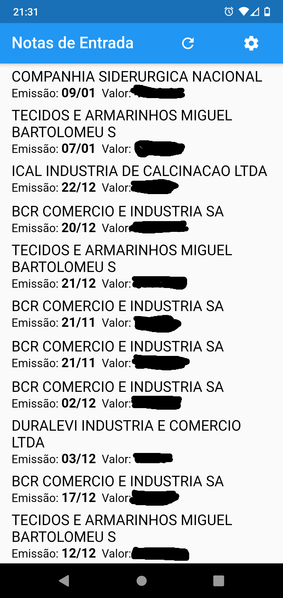
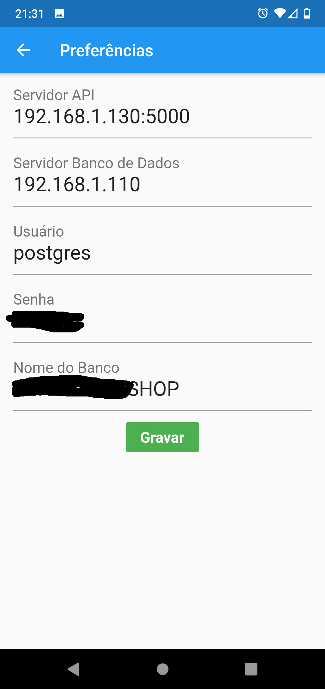
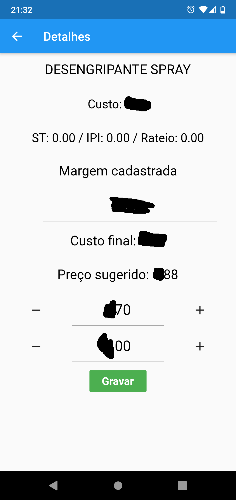

# engine_mobile

Projeto que fiz para aprender Python e facilitar a vida em minha loja, para precificar produtos. 

Sistema simples, que lista as notas de entrada, abre os itens da nota, e permite ajustar o preço de venda. Atualmente eu o uso associado ao sistema Alterdata, mas você pode adaptá-lo simplesmente ajustando as queries no arquivo compras.py

<table><tr>
  <td></td>
  <td></td>
  <td></td>
  <td></td>
  </tr></table>

# engine_api

Esse app trabalha junto com a API em python, disponível no meu repositório.

